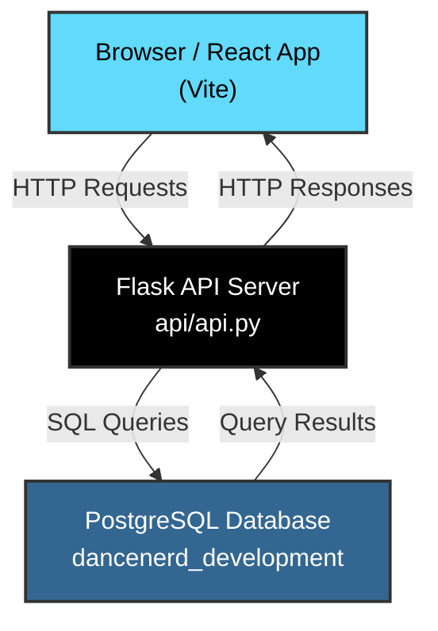
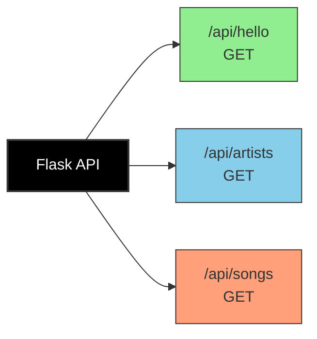
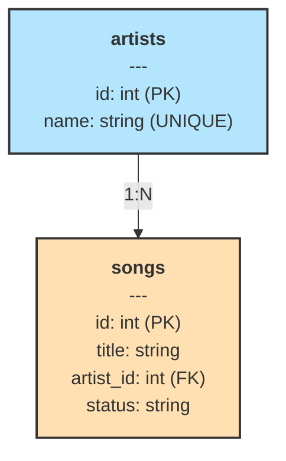
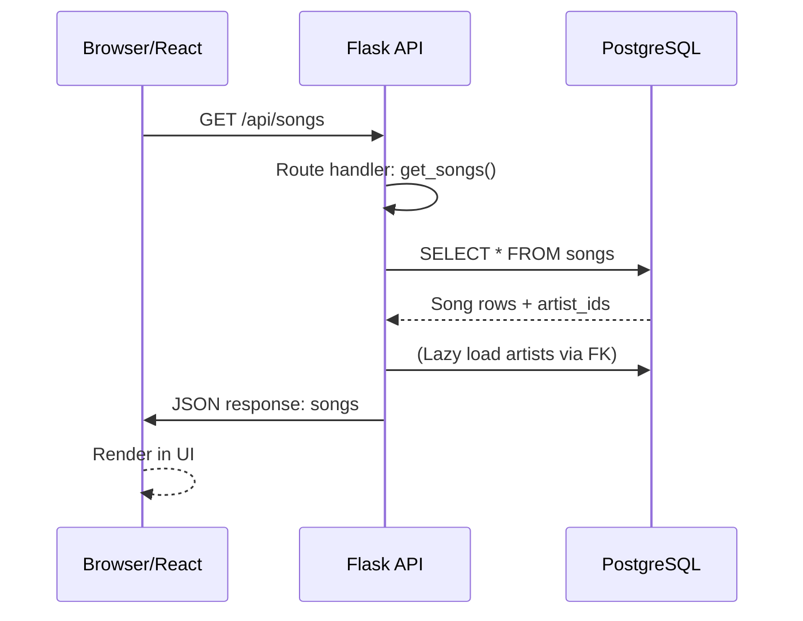

# Dance Dance Database - Architecture Diagram

## System Architecture

## API Endpoints

## Database Schema

## Application Stack

| Layer | Technology | Location |
|-------|-----------|----------|
| **Frontend** | React + Vite | `src/` |
| **Backend** | Flask + SQLAlchemy | `api/api.py` |
| **Database** | PostgreSQL | `dancenerd_development` |
| **Migrations** | Flask-Migrate (Alembic) | `migrations/` |
| **Testing** | pytest | `tests/` |

## Request Flow Example: Get All Songs

## Current Status

✅ **Implemented:**
- PostgreSQL database with Artist and Song models
- Flask API with basic demo routes
- Flask-Migrate for schema versioning
- pytest with fixtures for integration and unit tests
- Database seeding via `flask seed` command

⏳ **Not Yet Implemented:**
- Frontend React components
- CRUD endpoints
- Authentication/Authorization
- Input validation
- Error handling
- API documentation (Swagger/OpenAPI)
